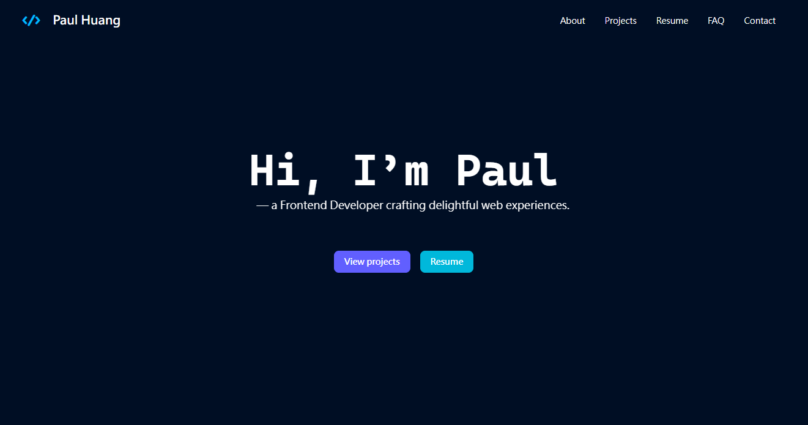
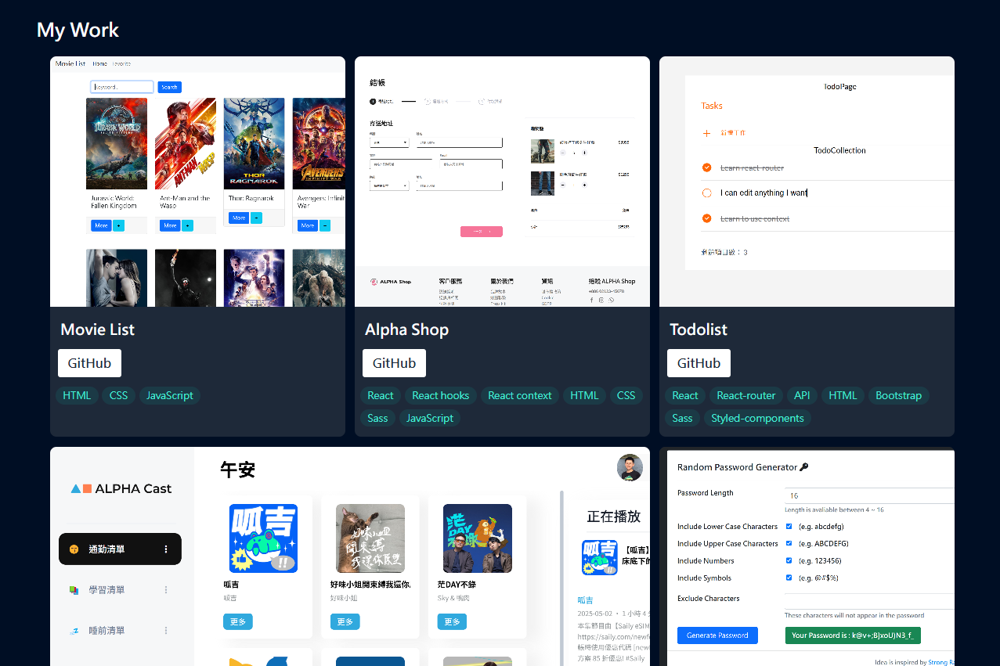
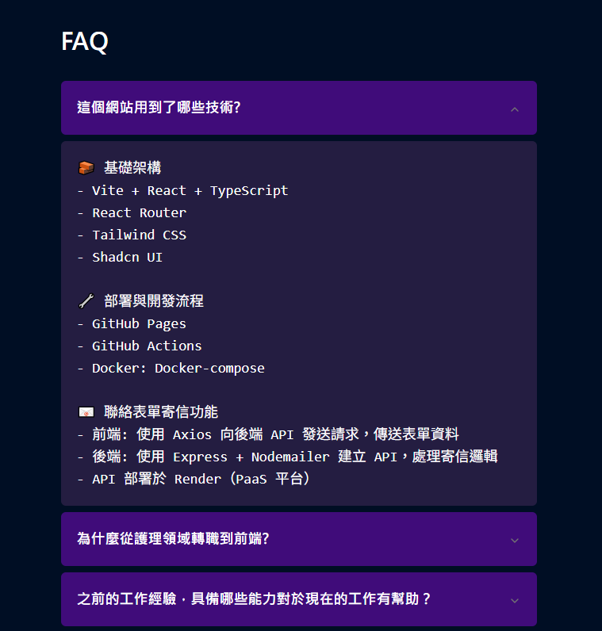
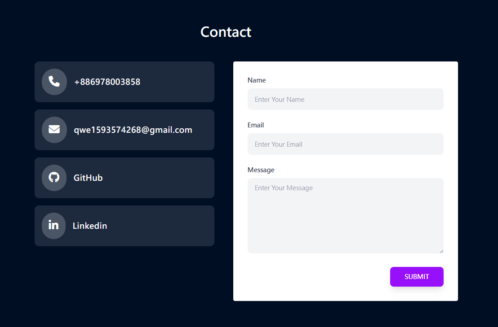

# React-Tenfolio

🎨 **React-Tenfolio** 是一個個人作品集網站，展示我的前端開發能力與專案經驗，包含自我介紹、作品展示與聯絡表單等功能，提供簡潔專業的個人品牌頁面。

## 🔗 網站連結

👉 [前往查看](https://pt-huang.github.io/react-tenfolio/)

---

## 🧱 使用技術

### 前端架構
- Vite + React + TypeScript
- React Router
- Tailwind CSS
- Shadcn UI

### 部署與開發流程
- GitHub Pages
- GitHub Actions
- Docker + Docker Compose

### 聯絡表單寄信功能
- 前端：使用 Axios 向後端 API 發送請求，傳送表單資料
- 後端：使用 Express + Nodemailer 建立 API，處理寄信邏輯
- API 部署於 Render（PaaS 平台），並透過 UptimeRobot 維持伺服器存活

---

## 📸 Screenshots

### 🖥️ 首頁畫面d

### 📂 作品展示區塊

### 📂 常見問答區

### 📬 聯絡表單區
